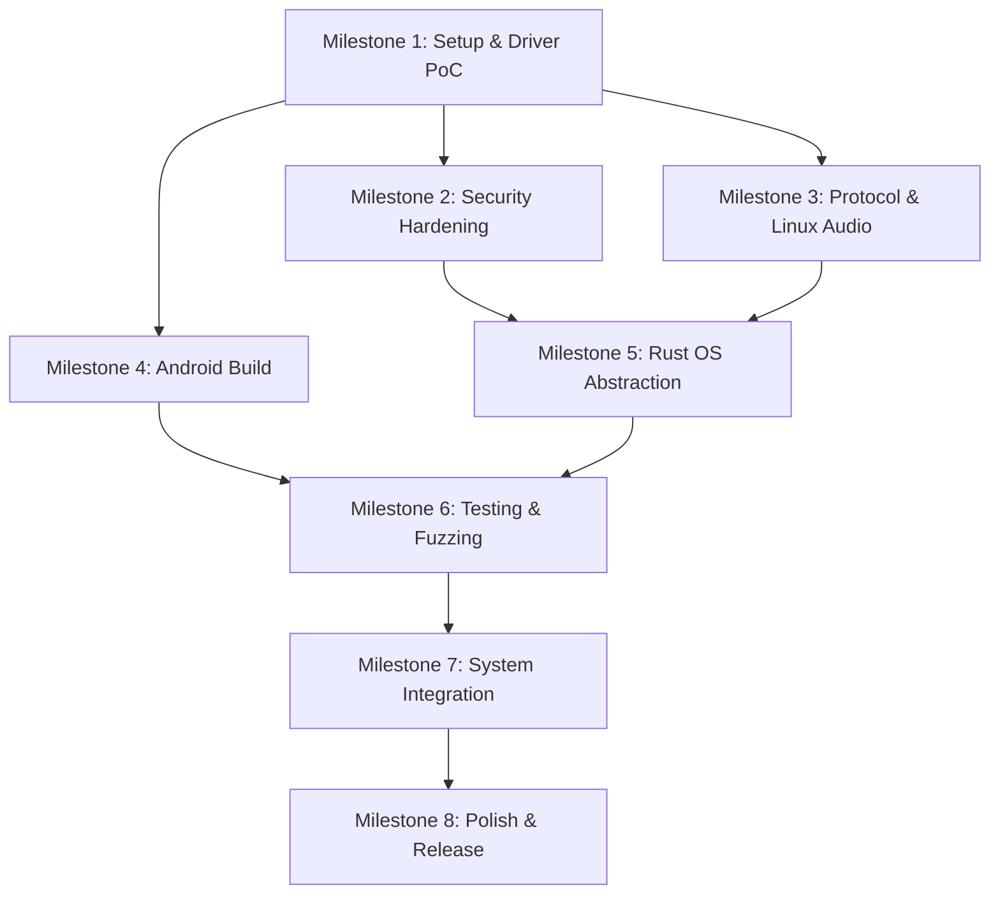

# Project Transition Plan: Custom Microphone Sharing App

This document outlines the detailed and optimized plan to replace the proprietary WO Mic connection with our custom, low-latency audio streaming system, expanding the ecosystem to support both Linux and Windows.

---

## 1. Project Restructuring & Renaming

### Directory Layout (Monorepo)
We will reorganize the workspace to support the PC client (Rust), the Windows Kernel Driver (C++), and the Android client (Kotlin) under a single repository:

```
project-m/
├── Cargo.toml                  # Cargo Workspace configuration
├── Justfile                    # Top-level build orchestration
├── .github/workflows/          # CI/CD pipeline definitions
│   ├── rust.yml                # cargo fmt, clippy, test, audit, latency-bench
│   ├── android.yml             # gradlew lint, test, dependencyCheck
│   └── driver.yml              # WDK build verification (Windows runner)
├── pc-client/                  # Rust cross-platform client (Slint UI)
│   ├── Cargo.toml              # Dependencies: rustls, spake2, tokio, slint, pipewire
│   ├── rustfmt.toml            # Code formatting rules
│   ├── clippy.toml             # Lint configuration
│   ├── src/
│   │   ├── main.rs
│   │   ├── protocol.rs         # MC framed TCP receiver & parser
│   │   ├── app_state.rs        # UI state, connection management, ADB forwarding
│   │   ├── error.rs            # Custom AppError enum (thiserror)
│   │   └── audio/              # Cross-platform audio abstraction
│   │       ├── mod.rs          # AudioBackend trait
│   │       ├── linux.rs        # PipeWire playback loop
│   │       └── windows.rs      # IOCTL bridge to custom kernel driver
│   └── ui/                     # Slint files
├── windows-driver/             # C++ Windows Kernel Virtual Audio Driver
│   ├── lampyris-mic.sln        # Visual Studio Solution
│   ├── lampyris-mic.vcxproj    # Driver build configuration
│   ├── driver.cpp              # Sysvad port/Miniport logic
│   └── ioctl.h                 # Shared IOCTL definitions (used by Rust & C++)
└── android-client/             # Android app (Kotlin & Jetpack Compose)
    ├── build.gradle.kts
    ├── app/
    │   ├── src/main/
    │   │   ├── AndroidManifest.xml
    │   │   └── java/...        # Microphone capture, UI, TLS server, SPAKE2 auth
    └── ...
```

### Build Orchestration
A top-level `Justfile` provides unified commands across the heterogeneous stack:
* `just build-all` — Builds Rust client, Android APK, and Windows driver.
* `just test-all` — Runs all unit tests, integration tests, and lint checks.
* `just lint-all` — Runs `cargo clippy`, `cargo fmt --check`, `ktlint`, and driver static analysis.
* `just audit` — Runs `cargo audit`, `cargo deny`, and Gradle dependency checks.
* `just bench-latency` — Runs processing-latency benchmark (see §7).

---

## 2. Audio & Connection Protocol Design

To achieve the lowest possible latency and overhead without compression artifacts, we will stream **raw PCM audio** over TLS-encrypted TCP.

### Transport Strategy
* **TCP for both USB and Wi-Fi**. TCP is the correct choice for v1:
    * USB/ADB is a dedicated wired link — TCP is ideal.
    * Wi-Fi LAN: TCP's retransmission delay is the theoretical concern, but for a single mono audio stream there is no Head-of-Line blocking (HoL blocking only affects multiplexed streams). The sequence number field (see framing below) enables detection of stalls, and the jitter buffer absorbs transient delays.
    * QUIC may be evaluated in v2 **only if measured Wi-Fi latency data shows TCP retransmission is the bottleneck** (see §14: Future Work).

### Protocol Parameters
* **Base Sample Rate**: 48,000 Hz.
* **Format**: 16-bit Signed PCM, Little-Endian (`s16le`).
* **Channels**: Mono (1 channel).
* **Data Rate**: ~768 kbps.

### Stream Framing
```
+--------+--------+----------+-----------+-----------------------+
| Magic  | Ver/   | Seq No.  | Payload   | Raw PCM Data          |
| (2B)   | Flags  | (2B BE)  | Size      | (up to 4800 bytes)    |
|        | (1B)   |          | (2B BE)   |                       |
+--------+--------+----------+-----------+-----------------------+
```

* **Magic**: `0x4D 0x43` (`'MC'`). Constant frame header marker.
* **Version/Flags** (1 byte): Upper 4 bits = protocol version (currently `0x1`). Lower 4 bits = flags (reserved: bit 0 = sample rate indicator, see Degraded Mode below).
* **Sequence Number** (2 bytes, Big-Endian): Monotonically increasing U16, wraps at 65535. Used to detect frame drops — if gap detected, receiver inserts silence for the missing frames and logs a `WARN`.
* **Payload Size** (2 bytes, Big-Endian): Maximum capped at **4,800 bytes** (50ms of 48kHz mono s16le). Frames exceeding this limit MUST be rejected and the connection reset. This limit is an explicit protocol constant, not an implicit artifact of the receive buffer size.
* **PCM Data**: Raw 16-bit signed mono PCM bytes.
* **Integrity**: Relies on TLS record-layer AEAD integrity (guaranteed by `rustls`). In development/debug mode without TLS, append a CRC-32 after the payload.

### Protocol Versioning
* Protocol version `1` = current MC framing as defined above.
* Clients MUST reject frames with unsupported version numbers and display a "please update your app" message to the user.
* Maintain backward compatibility for at least 1 major version.

### Degraded Mode
Under sustained network degradation, the sender may dynamically reduce the sample rate to maintain real-time continuity:

* **Decision authority**: The **sender** (Android) decides to degrade based on its own observation of TCP send buffer backpressure (write stalls > 50ms sustained for 3+ consecutive frames).
* **Signaling**: The flags field bit 0 indicates the active rate: `0` = 48kHz (default), `1` = 24kHz fallback. The switch is **per-frame** — each frame self-describes its sample rate, so the receiver requires no state machine or renegotiation.
* **Receiver handling**: The receiver's jitter buffer and PipeWire/WASAPI sink remain configured at 48kHz. When a 24kHz frame arrives (flag bit 0 = 1), the receiver performs simple linear upsampling (duplicate each sample) to fill the 48kHz output buffer. This is a zero-dependency, zero-latency operation.
* **Recovery**: When backpressure clears (write completes within 10ms for 10+ consecutive frames), the sender resumes 48kHz. No explicit recovery signal is needed — the flag field on the next frame communicates the change.

---

## 3. Security Architecture

### Threat Model
The following attack surfaces are explicitly considered:
* **Wi-Fi MITM**: Attacker on the same LAN intercepts the initial pairing handshake.
* **Brute-force PIN attacks**: Repeated guessing of the 6-digit pairing PIN.
* **Rogue clients on LAN**: Unauthorized device connects to the Android TLS server.
* **Malformed protocol frames**: Crafted packets designed to crash the parser or exhaust memory.
* **Driver IOCTL abuse**: Unprivileged local process sends malicious IOCTLs to the kernel driver device object.
* **ADB hijacking**: Compromised USB host exploits the ADB bridge.

### Transport Security (TLS)
* **Library**: `rustls` (pure Rust, audited, no C/OpenSSL dependencies) on PC; JSSE with BouncyCastle provider on Android.
* **Minimum Version**: TLS 1.3 mandatory. TLS 1.2 accepted as fallback only.
* **Certificate Model**: Android server generates a self-signed **Ed25519** certificate at service startup via BouncyCastle (1.78+). Ed25519 is explicitly chosen over RSA-2048 to reduce key generation latency on mobile and minimize TLS handshake sizes.
* **Current Gap**: The existing `DummyVerifier` in `app_state.rs` that unconditionally accepts all certificates MUST be replaced with the TOFU verifier. This is a **P0 blocker** for any public release.

### Authentication (SPAKE2 + TOFU)
Simple TOFU with a plaintext PIN over TLS is vulnerable to first-connection MITM (if the TLS verifier is compromised, the PIN is intercepted). Instead:

1. **SPAKE2** (Password-Authenticated Key Exchange) is performed using the 6-digit UI PIN as the shared password. The PIN is **never transmitted over the wire** — it is used to cryptographically derive mutual session keys, making interception of the PIN impossible even by an active MITM.
2. After the SPAKE2 handshake succeeds on first connection, the PC client **pins the Ed25519 certificate SHA-256 fingerprint** locally. Subsequent connections verify the pinned certificate and skip the PIN step.
3. **Brute-force protection**: The Android server allows a maximum of 3 failed SPAKE2 attempts per session → 30-second lockout → 5-minute lockout → session reset. Even though SPAKE2 makes offline dictionary attacks computationally expensive, rate limiting provides defense-in-depth against a 6-digit keyspace (1M possibilities).
4. **Android SPAKE2 implementation**: Use BouncyCastle's `SRP` primitives or a JNI binding to the `spake2` Rust crate compiled as a native library. Document the chosen approach in a design decision record.

### Keystore Hygiene
* Replace the hardcoded `"password"` string in the Android PKCS12 keystore (`AudioCaptureService.kt`) with a random password generated at runtime via `SecureRandom`, stored only in memory.

### Network Access Control
* **USB/ADB Mode**: Bind the TLS server to `127.0.0.1` only — zero network exposure.
* **Wi-Fi Mode**: Accept at most **1 concurrent client** connection. Reject additional connections immediately.
* **Port**: Default `47999`, user-configurable.

---

## 4. Windows Virtual Audio Driver (Kernel Mode)

Windows isolates audio hardware representations in the kernel. Creating a Kernel-Mode Driver (KMD) is the preferred path, but carries high execution risk.

### High-Risk Assessment: EV Code Signing
* **The Blocker**: Microsoft WHQL strictly requires an Extended Validation (EV) Code Signing Certificate to countersign kernel drivers. This requires a registered corporate entity and significant cost (~$400/year minimum).
* **Mitigation Strategy**: The KMD prototype is shifted to **Milestone 1** as a go/no-go gate. If EV signing proves administratively impossible, the fallback architecture is to use a **User-Mode APO (Audio Processing Object)** or bridge via an existing signed virtual audio cable (e.g., VB-Cable) through Windows Core Audio APIs.

### Architecture & Security (If Proceeding with KMD)
* **Framework**: Port Class (PortCls) / `sysvad` sample driver.
* **Language**: C++ compiled with the Windows Driver Kit (WDK).

### IOCTL Security Requirements
* **Input Validation**: Validate all IOCTL input buffer sizes in the driver before copying. Reject buffers exceeding the maximum frame size (4,800 bytes). Never trust user-mode length fields.
* **Buffer Method**: Use `METHOD_BUFFERED` for all IOCTLs to prevent user-mode pointer abuse.
* **Access Control (DACL + Shared Secret)**: Set a restrictive DACL on the device object — only the current interactive user session + `SYSTEM` should have write access. Additionally, the driver generates a random 32-byte session token at load time and writes it to a registry key readable only by the current user. The Rust client must present this token via an initial `IOCTL_LAMPYRIS_AUTHENTICATE` call before `IOCTL_LAMPYRIS_PUSH_AUDIO` is accepted. This prevents rogue user-space apps from injecting fake microphone audio even if running as the same user.
* **Rate Limiting**: Reject IOCTL calls exceeding the expected PCM data rate by >10%.
* **Ring Buffer Overflow**: Silently drop oldest data on overflow. Never block the calling thread, never trigger a bugcheck (BSOD).
* **Fuzzing**: Run the IOCTL interface through Driver Verifier + IoSpy/IoAttack before any release.

### Driver Signing
* **Development Phase**: Use "Test Mode" (`bcdedit /set testsigning on`) with a self-generated test certificate.
* **Production Release**: Obtain an EV Code Signing Certificate and submit to WHQL for Microsoft cross-signing.

---

## 5. PC Client Adaptation (`pc-client`)

The Rust PC client will be abstracted to support both operating systems automatically at compile-time.

### OS Abstraction Strategy
1. **`audio/mod.rs`**: Defines a common `AudioBackend` trait.
2. **`audio/linux.rs`**: Uses the existing `pipewire` crate to stream audio into a virtual source.
3. **`audio/windows.rs`**: Uses the `windows-rs` crate to call `CreateFileW` and `DeviceIoControl`, feeding data to the custom kernel driver (or fallback WASAPI interface for APO path).

### Reliability & Stability
* **Jitter Buffer**: A lock-free ring buffer (`ringbuf` crate, currently implemented in Linux, will be mirrored/adapted for Windows) to absorb network jitter and minor clock drift.
* **Protocol Resync**: The `protocol.rs` logic automatically scans for the `MC` magic marker if corrupt data is received, preventing crashes. Resync events are logged at `WARN` level.
* **Sequence Gap Detection**: When a gap in sequence numbers is detected, the receiver inserts silence frames for the missing data and increments the `frames_dropped` counter.
* **Graceful Disconnects**: Explicit handling of connection drops to reset the virtual microphone state to silence.
* **Payload Size Enforcement**: `protocol.rs` rejects any frame with a payload size exceeding 4,800 bytes. This is an explicit constant (`MAX_PAYLOAD_SIZE`), not an implicit artifact of the receive buffer.

### Error Handling
* Define a custom `AppError` enum (via `thiserror`) in `error.rs` with variants: `ConnectionLost`, `ProtocolError`, `AudioBackendError`, `AdbError`, `AuthenticationFailed`, `Spake2Error`.
* Use `anyhow` for application-level error propagation (already in place).
* Replace any `assert!()` on data-dependent invariants with `Result::Err` returns. The only acceptable panics are programmer logic errors (e.g., `unreachable!()`).
* Make the log file path configurable via CLI argument or environment variable (do not hardcode `/tmp/lampyris.log`).
* Enforce `#![deny(clippy::unwrap_used)]` at the crate level. All new code must use `?` propagation or explicit `.expect("invariant: reason")`.
* All `unsafe` blocks must retain `// SAFETY:` comments documenting invariants. Review all unsafe blocks when Windows support is added.

---

## 6. Android Client Implementation (`android-client`)

* **Tech Stack**: Kotlin, Jetpack Compose, `AudioRecord` API.
* **Core Components**:
    * `AudioCaptureService`: Foreground service with persistent notification. Captures 48kHz 16-bit mono PCM. Generates an Ed25519 certificate and hosts the TLS server. Handles SPAKE2 authentication. Implements degraded mode (24kHz fallback) on send buffer backpressure.
    * `MainActivity`: Jetpack Compose UI with USB/Wi-Fi mode selector, IP display, port configuration, and PIN display.

### Security Hardening
* `SecureRandom()` for PIN generation (replace `java.util.Random()`).
* Constant-time comparison for SPAKE2 verification (`MessageDigest.isEqual()`).
* Bind TLS server to `127.0.0.1` in USB/ADB mode.
* Replace hardcoded keystore password `"password"` with runtime-generated random.
* Remove plaintext PIN logging from error paths (`Log.e(TAG, "Invalid PIN: $receivedPin")` → log only the event, not the value).
* Network I/O in `SupervisorJob` coroutine scopes — TLS errors reset to idle state without crashing the foreground service.

---

## 7. Testing Strategy

### Unit Tests
* **Protocol parser** (`protocol.rs`): Fuzz with `cargo-fuzz` / `libFuzzer` using arbitrary byte sequences. Target: zero panics, zero out-of-bounds reads. Expand existing 3 tests to cover: zero-length payloads, max-size payloads, oversized payloads (>4800B), invalid magic bytes, corrupted sequence numbers, version mismatch, degraded mode flag.
* **Audio backend trait**: Mock implementations for deterministic testing without hardware.
* **IOCTL handler** (Windows driver): Unit test with crafted IOCTLs — 0-byte, normal, maximum-size, and oversized buffers. Verify shared secret authentication rejects unauthorized callers.
* **SPAKE2 auth flow**: Test correct PIN, wrong PIN, brute-force lockout engagement, lockout recovery timing.

### Integration Tests
* **End-to-end loopback**: Android emulator → TLS/TCP → PC client → virtual audio → capture → compare PCM checksums.
* **Protocol version mismatch**: Verify graceful rejection when client and server use different protocol versions.
* **Degraded mode**: Simulate TCP backpressure → verify sender drops to 24kHz → verify receiver upsamples → verify recovery to 48kHz.

### Performance Benchmarks (CI-Enforced)
* **What is measured**: **Processing latency** — the time from TCP `read()` completion to audio buffer `write()` completion. This isolates code quality from network/hardware variance.
* **Assertion**: `assert(processing_latency_p99 < 2ms)`. This runs on CI (including shared GitHub Actions runners) because it measures only CPU-bound processing, not network round-trip.
* **Where it runs**: `just bench-latency` target. Self-hosted runner recommended for stability, but shared runners are acceptable for processing-only benchmarks.
* **End-to-end latency** (including network): Measured manually on dedicated hardware before each release. Targets defined in §11.

### Security Tests
* **Driver fuzzing**: Microsoft HLK / Driver Verifier / IoAttack.
* **Protocol fuzzing**: AFL++ or libFuzzer on `protocol.rs` parser.
* **TLS configuration scan**: Verify with `testssl.sh` or `sslyze` that only TLS 1.2+ is accepted and weak ciphers are rejected.
* **PIN brute-force**: Verify lockout engages after 3 failed attempts.

---

## 8. Observability & Diagnostics

### Client-Side Logging (Rust)
* Use the `tracing` crate with structured JSON output.
* Log levels:
    * `ERROR`: Connection failures, TLS handshake errors, authentication rejections.
    * `WARN`: Protocol resync events, jitter buffer underruns, frame drops, degraded mode transitions.
    * `INFO`: Connection lifecycle (connect, disconnect, pairing success).
    * `DEBUG`: Frame-level stats (sequence numbers, payload sizes, buffer fill level).
* Rotate logs to prevent disk exhaustion (max 10MB, 3 rotated files).

### Runtime Metrics (Exposed in UI)
* Current measured latency (ms).
* Jitter buffer fill level (%).
* Frames dropped / resynced in last 60 seconds.
* Connection uptime.
* Audio pipeline state (idle / streaming / degraded / error / reconnecting).
* Current sample rate (48kHz or 24kHz degraded).

### Diagnostic Export
* **Strict Privacy**: No automatic network telemetry is collected. Ever.
* **Supportability**: The UI includes a **"Generate Diagnostic Export"** button. This packages recent local logs, latency histograms, and version mismatch data into a compressed zip file that the user can voluntarily attach to GitHub Issue reports.

### Android Diagnostics
* Use `Timber` for structured logging.
* Expose diagnostic info in a debug panel behind a long-press gesture on the status indicator.
* Log connection events (connect, disconnect, auth success/failure count) with timestamps.

---

## 9. Error Handling Philosophy

* **Rust**: `anyhow` for app-level, `thiserror` for programmatic domains (`ProtocolError`, `AudioBackendError`, `AdbError`, `Spake2Error`). `#![deny(clippy::unwrap_used)]` enforced crate-wide.
* **Windows Driver**: All handlers return `NTSTATUS`. Never bugcheck. Log errors via WPP tracing.
* **Android**: Network I/O in `SupervisorJob` scopes. TLS/auth errors reset to idle state without crashing the foreground service.

---

## 10. Dependency Management & Supply Chain

### Rust (`pc-client`)
* Key dependencies: `rustls`, `spake2`, `tokio`, `slint`, `pipewire`, `ringbuf`, `tracing`, `anyhow`, `thiserror`.
* Pin all dependency versions via `Cargo.lock` (committed to repo).
* Run `cargo audit` and `cargo deny` in CI on every PR.
* Remove unused dependencies: `rcgen`, `rustls-pemfile` (currently listed but not used).
* Enforce `cargo fmt --check` in CI.

### Android (`android-client`)
* Enable Gradle dependency locking (`gradle.lockfile`).
* Run `./gradlew dependencyCheckAnalyze` for CVE scanning in CI.
* Keep BouncyCastle and Compose BOM versions current — review quarterly.

### Binary Distribution
* **Do not commit compiled binaries to git**. Remove existing binaries (`lampyris-linux-x86_64-v1.1.0.tar.gz`, `lampyris-v1.1.0-linux-x86_64`) from git history using BFG Repo-Cleaner.
* Add binary patterns to `.gitignore`.
* Distribute release binaries via GitHub Releases with SHA-256 checksums.

### TLS Library Decision Record
* PC client uses `rustls` — a pure-Rust, audited TLS library with no C/OpenSSL dependencies. This eliminates an entire class of supply-chain vulnerabilities. This decision is intentional and should be maintained.

---

## 11. Privacy & Data Handling

* **No Persistence**: Audio is never written to disk on either device. All PCM data exists only in memory buffers during active streaming.
* **Microphone Indicator**: The Android foreground service notification is always visible when the microphone is active. The notification cannot be dismissed while streaming.
* **Explicit User Action**: Streaming requires explicit user action on **both** devices — the Android user must press START, and the PC user must click Connect and complete PIN pairing.
* **No Telemetry**: The application does not collect, transmit, or store any usage analytics or personal data.
* **Sensitive Data in Logs**: Auth PINs must never appear in log output. Failed authentication attempts log only the event, not the received PIN value.
* **Diagnostic Export**: Generated locally, contains only technical logs. User must explicitly choose to share it. No automatic uploads.

---

## 12. Latency Targets

| Connection Mode | Target Latency (end-to-end) | Maximum Acceptable |
|----------------|----------------------------|-------------------|
| USB (ADB)      | ≤ 10 ms                    | 15 ms             |
| Wi-Fi (LAN)    | ≤ 20 ms                    | 30 ms             |

### Measurement Method
* Inject a known impulse signal on Android, measure time to PipeWire/WASAPI output on PC using either:
    * A loopback hardware setup (3.5mm cable from output to second mic input), or
    * Software correlation of timestamped PCM frames using the sequence number field.
* Measured manually on dedicated hardware before each release. Results documented in release notes.

---

## 13. CI/CD Pipeline

### Rust (`rust.yml`)
* **Trigger**: On every push and PR to `main`.
* **Steps**: `cargo fmt --check` → `cargo clippy -- -D warnings -D clippy::unwrap_used` → `cargo test` → `cargo audit` → `just bench-latency` (processing latency p99 < 2ms gate).
* **Artifacts**: Upload compiled binary to GitHub Releases on tagged commits with SHA-256 checksums.

### Android (`android.yml`)
* **Trigger**: On every push and PR to `main`.
* **Steps**: `ktlint` → `./gradlew lint` → `./gradlew test` → `./gradlew dependencyCheckAnalyze`.
* **Artifacts**: Upload signed APK to GitHub Releases on tagged commits.

### Windows Driver (`driver.yml`)
* **Trigger**: On every push to `windows-driver/` directory.
* **Runner**: Self-hosted Windows with WDK installed.
* **Steps**: MSBuild compile → Driver Verifier static analysis.

---

## 14. Execution Milestones



### Milestone 1: Project Setup & High-Risk Driver PoC
* **Critical Path**: Fork Microsoft `sysvad` sample into `windows-driver/`. Compile and install on a Test-Mode Windows machine.
* Evaluate the EV Code Signing blocker. Decide firmly between custom KMD or User-Mode APO fallback.
* Restructure monorepo. Set up Cargo Workspace and `Justfile`.
* Set up CI/CD pipelines (GitHub Actions for Rust, Android, Driver).
* Remove existing committed binaries from git history (BFG). Add `.gitignore` rules.

### Milestone 2: Security Hardening & PAKE (P0)
* Replace `DummyVerifier` in `app_state.rs` with TOFU certificate pinning.
* Implement SPAKE2 PIN authentication (Rust: `spake2` crate; Android: BouncyCastle or JNI).
* Generate Ed25519 self-signed certificates on Android (replace RSA-2048).
* Implement brute-force lockout (3 attempts → 30s → 5min → reset).
* Replace `java.util.Random()` with `SecureRandom()`.
* Replace hardcoded keystore password with runtime-generated random.
* Remove plaintext PIN logging.
* Bind TLS server to `127.0.0.1` in USB/ADB mode.

### Milestone 3: Protocol Upgrade & Linux Audio
* Upgrade to v1 protocol framing: version/flags byte, sequence numbers, explicit max payload cap (4,800B).
* Implement sequence gap detection with silence insertion.
* Implement degraded mode signaling (sender-driven, flag bit 0, per-frame).
* Define custom `AppError` enum and eliminate all `unwrap()` on I/O paths.
* Feed PCM stream to PipeWire via lock-free jitter buffer.

### Milestone 4: Android Audio Capture & Streaming
* Jetpack Compose UI.
* Implement `AudioRecord` capture loop with v1 protocol framing.
* Wire up SPAKE2 + Ed25519 certificate hosting.
* Implement degraded mode sender logic (backpressure detection → 24kHz fallback).
* Apply all security hardening items from Milestone 2.

### Milestone 5: Rust OS Abstraction (Windows Support)
* Create `audio/mod.rs`, `audio/linux.rs`, and `audio/windows.rs`.
* Implement `DeviceIoControl` logic with shared-secret authentication to stream to the kernel driver.
* Implement WASAPI fallback path for APO architecture (if KMD path was rejected in Milestone 1).
* Ensure all `unsafe` blocks have `// SAFETY:` documentation.

### Milestone 6: Testing & Fuzzing
* Fuzz `protocol.rs` with `cargo-fuzz` — target zero panics.
* Fuzz IOCTL boundaries with Driver Verifier / IoAttack.
* End-to-end loopback integration test (Android emulator → PC → audio capture → checksum).
* TLS configuration scan with `testssl.sh`.
* PIN brute-force lockout verification.
* Set up processing latency CI gate (`p99 < 2ms`).
* Build the "Diagnostic Export" ZIP generator.

### Milestone 7: System Integration & Polish
* End-to-end testing across USB (ADB) and Wi-Fi on both Linux and Windows.
* Tune latency and jitter buffer settings for Windows audio engine tick rates.
* Verify latency targets: USB ≤10ms, Wi-Fi ≤20ms on dedicated hardware.
* Implement observability: runtime metrics in UI, structured logging, log rotation.
* Remove unused dependencies (`rcgen`, `rustls-pemfile`).
* Measure actual clock drift between Android and PC. Document findings.

### Milestone 8: Release
* Acquire EV Code Signing Certificate (if KMD path).
* Submit to WHQL (if KMD path).
* Generate SHA-256 checksums for all release artifacts.
* Publish release binaries to GitHub Releases (not committed to repo).
* Final cross-platform release with documented latency measurements.

---

## 15. Future Work (v2)

The following features are explicitly **deferred to v2** to avoid scope creep. Each requires measured data to justify implementation:

* **QUIC transport for Wi-Fi**: Only if measured TCP Wi-Fi latency data shows retransmission delay is the dominant latency contributor. Requires finding a mature Kotlin QUIC library (cronet or JNI) for the Android side.
* **Asynchronous Sample Rate Conversion (ASRC)**: Only if measured clock drift data (collected in Milestone 7) shows the jitter buffer cannot absorb oscillator drift over sustained sessions (>30 minutes). If needed, implement via the `rubato` crate with adaptive rate correction based on buffer fill level.
* **Multi-client support**: Allow multiple PCs to receive from one Android device simultaneously.
* **Opus compression mode**: Optional lossy compression for very poor network conditions, signaled via the flags field.