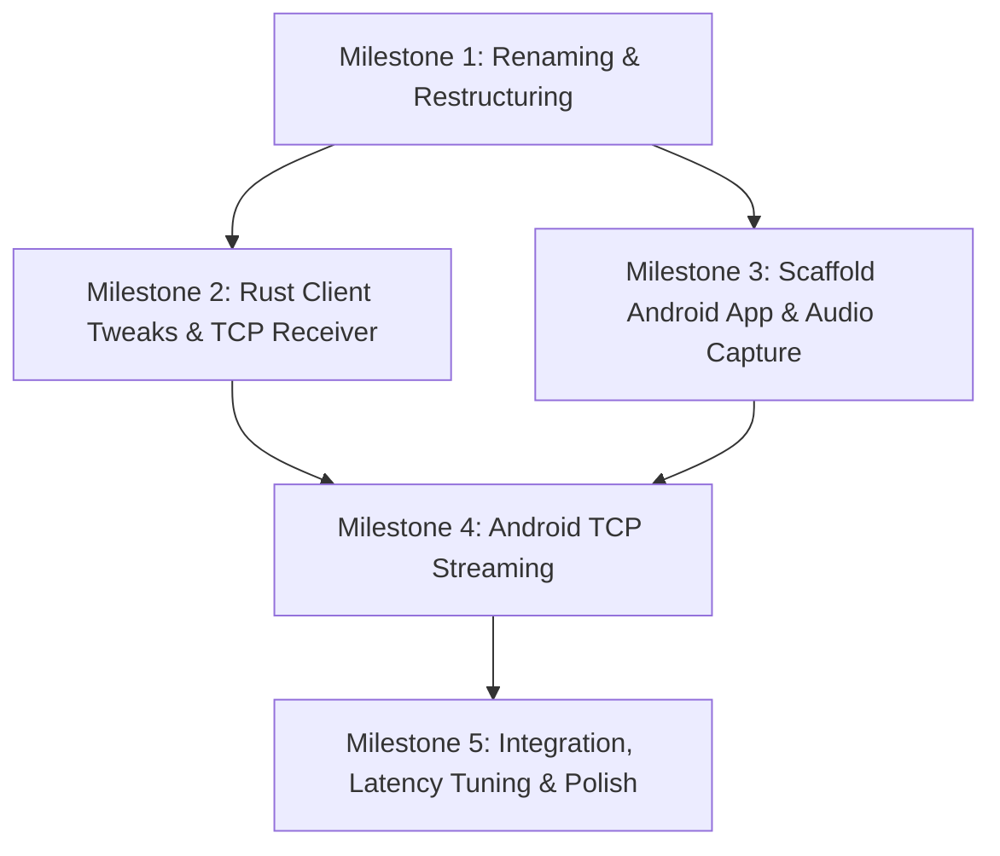

# Project Transition Plan: Custom Microphone Sharing App

This document outlines the detailed and optimized plan to replace the proprietary WO Mic connection with our custom, low-latency audio streaming system. Since we are building this from scratch, we will rename the project and restructure the repository into a monorepo.

---

## 1. Project Restructuring & Renaming

### Directory Layout (Monorepo)
We will reorganize the workspace to support both the PC client (Rust) and the Android client (Kotlin) under a single repository:

```
project-m/
├── Cargo.toml                  # Cargo Workspace configuration
├── pc-client/                  # Rust Linux client (Slint UI)
│   ├── Cargo.toml
│   ├── build.rs
│   ├── src/
│   │   ├── main.rs
│   │   ├── audio.rs            # PipeWire playback loop
│   │   ├── protocol.rs         # Clean TCP receiver & parser
│   │   └── app_state.rs        # UI state and state machine
│   └── ui/                     # Slint files
└── android-client/             # Android app (Kotlin & Jetpack Compose)
    ├── build.gradle.kts
    ├── app/
    │   ├── src/main/
    │   │   ├── AndroidManifest.xml
    │   │   └── java/...        # Microphone capture, UI, and TCP sender
    └── ...
```

### Transition Steps
1. **Rename Root Directory**: Rename the directory from `WO Mic Replica` to the new project name. (Note: We keep the files in the workspace while updating internal name references to project-m).
2. **Move Rust Code**: Move current Rust codebase (except `.git` and global configs) into a new `pc-client/` directory.
3. **Configure Workspace**: Update the root `Cargo.toml` to define a Cargo workspace.
4. **Scaffold Android Code**: Create the `android-client/` directory and scaffold a basic Gradle-based Kotlin Android app.

---

## 2. Audio & Connection Protocol Design

To achieve the lowest possible latency and overhead without compression artifacts, we will stream **raw PCM audio** over TCP. Because ADB forward / LAN connections easily support >10 Mbps, raw audio is highly feasible and bypasses CPU-heavy Opus encoding/decoding.

### Protocol Parameters
* **Sample Rate**: 48,000 Hz (Standard for Linux PipeWire and Android high-res audio).
* **Format**: 16-bit Signed PCM, Little-Endian (`s16le`).
* **Channels**: Mono (1 channel).
* **Data Rate**: $48,000 \text{ samples/sec} \times 2 \text{ bytes/sample} \times 8 \text{ bits/byte} = 768 \text{ kbps}$ (Under 0.1 MB/s, extremely safe for ADB/Wi-Fi).

### Stream Framing
To keep things simple, resilient, and extensible, we will frame audio packets using a lightweight header:
```
+-------------------+--------------------+-----------------------+
| Magic (2 bytes)   | Payload Size (U16) | Raw PCM Data (Bytes)  |
| 0x4D 0x43 ('MC')  | e.g., 960 bytes    | 16-bit Mono PCM bytes |
+-------------------+--------------------+-----------------------+
```
* **Magic Bytes (`0x4D`, `0x43` or 'M', 'C')**: Prevents processing random junk data on port scans or connection handshakes.
* **Payload Size (2 bytes, Big-Endian or Little-Endian)**: Tells the receiver exactly how many PCM bytes follow. For 48kHz audio, a 10ms frame is 960 bytes (480 samples).
* **Extensibility**: If we ever decide to add compression (e.g. Opus) or control messages, we can adjust the header or payload size.

---

## 3. Android Client Implementation (`android-client`)

The Android app will be built from scratch. It will capture audio from the microphone and send it to the PC client over a TCP connection.

### Tech Stack
* **Language**: Kotlin
* **UI Framework**: Jetpack Compose (Modern, reactive UI)
* **Audio Capture**: `AudioRecord` API (Direct hardware buffer access)
* **Concurreny/Networking**: Kotlin Coroutines + Java Socket API

### Core Components
1. **`AudioCaptureService`**:
   - Runs in the background (Foreground Service with a notification to prevent OS termination).
   - Initializes `AudioRecord` with `RECORD_AUDIO` permission, `48000 Hz`, `CHANNEL_IN_MONO`, and `ENCODING_PCM_16BIT`.
   - Reads chunks of audio (e.g., 480 samples / 960 bytes per read) into a buffer.
2. **`TcpClient`**:
   - Manages connection status (Connecting, Connected, Disconnected, Error).
   - Writes the frame header `['M', 'C', size_high, size_low]` followed by raw PCM bytes to the output stream.
   - Automatically handles retries and connection timeouts.
3. **Jetpack Compose UI**:
   - A single-screen dashboard.
   - **Connection Mode Selector**: Toggle between "USB (ADB)" and "Wi-Fi".
   - **Wi-Fi Target IP**: Text input for PC's IP address.
   - **Start/Stop Streaming Button**: Large, premium-styled toggle button.
   - **Visualizer**: Small real-time waveform display of microphone input amplitude.
   - **Connection Status indicator**: Colored glow indicators (Red/Green/Yellow).

---

## 4. PC Client Tweaks (`pc-client`)

The Rust PC client is already functional but currently has WO Mic-specific protocol handshakes and custom Opus framing. We will strip these out and optimize it for our new protocol.

### Tweaks Required
1. **Simplify `protocol.rs`**:
   - Remove WO Mic handshake state machine (commands like `0x65`, `0x66`, `0x67` and control ports).
   - Listen on a single port (e.g., `47999`) for incoming TCP connections.
   - Read the 4-byte header (`'M'`, `'C'`, and payload size), and read the designated PCM payload size.
2. **Remove `decoder.rs`**:
   - Delete the Opus decoder and configuration.
   - Pass the raw PCM bytes directly from the network loop to the audio buffer.
3. **Update `audio.rs`**:
   - Configure PipeWire playback for raw `s16le` format at `48,000 Hz` sample rate.
   - Ensure the audio queue has low latency but stays stable without underruns (jitter buffer / ring buffer implementation).
4. **Refactor Slint UI (`ui/`)**:
   - Simplify user controls (no need to show channel info or complex WO Mic statuses).
   - Update branding and colors to match the new project name.

---

## 5. Execution Milestones



### Milestone 1: Renaming & Restructuring
* Choose new project name.
* Rename directory.
* Set up Cargo Workspace.
* Create basic Android Gradle project structure.

### Milestone 2: PC Client Protocol Simplify
* Update `protocol.rs` to read raw `MC` framed packets.
* Bypass Opus decoder.
* Feed raw bytes to PipeWire stream.
* Build and verify zero warnings.

### Milestone 3: Android Audio Capture
* Implement UI with a start/stop streaming button.
* Implement foreground service.
* Request microphone permission.
* Implement `AudioRecord` loop and verify we are getting non-zero PCM samples.

### Milestone 4: Android TCP Streamer
* Integrate Java `Socket` with the audio loop.
* Stream structured packets to the PC receiver.
* Test over ADB port forwarding: `adb forward tcp:47999 tcp:47999`.

### Milestone 5: Integration & Polish
* Real-world testing.
* Adjust frame size (e.g., 5ms vs 10ms vs 20ms) to find the sweet spot for lowest latency and zero audio crackling.
* Style both UIs to have premium aesthetics (sleek dark mode, neon glow accents, soft micro-animations).
