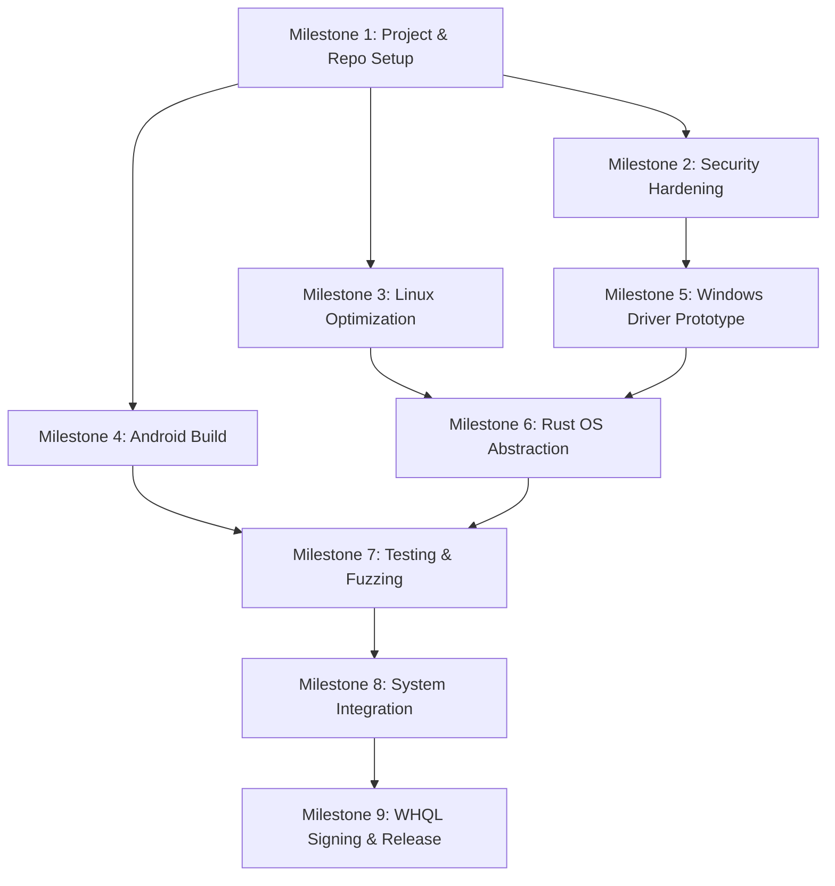

# Project Transition Plan: Custom Microphone Sharing App

This document outlines the detailed and optimized plan to replace the proprietary WO Mic connection with our custom, low-latency audio streaming system, expanding the ecosystem to support both Linux and Windows.

---

## 1. Project Restructuring & Renaming

### Directory Layout (Monorepo)
We will reorganize the workspace to support the PC client (Rust), the Windows Kernel Driver (C++), and the Android client (Kotlin) under a single repository:

```
project-m/
├── Cargo.toml                  # Cargo Workspace configuration
├── Justfile                    # Top-level build orchestration (build-all, test-all, lint-all)
├── .github/workflows/          # CI/CD pipeline definitions
│   ├── rust.yml                # cargo clippy, test, audit
│   ├── android.yml             # gradlew lint, test, dependencyCheck
│   └── driver.yml              # WDK build verification (Windows runner)
├── pc-client/                  # Rust cross-platform client (Slint UI)
│   ├── Cargo.toml
│   ├── build.rs
│   ├── rustfmt.toml            # Code formatting rules
│   ├── clippy.toml             # Lint configuration
│   ├── src/
│   │   ├── main.rs
│   │   ├── protocol.rs         # Clean TCP receiver & parser
│   │   ├── app_state.rs        # UI state, connection management, ADB forwarding
│   │   ├── error.rs            # Custom AppError enum (thiserror)
│   │   └── audio/              # Cross-platform audio abstraction
│   │       ├── mod.rs
│   │       ├── linux.rs        # PipeWire playback loop
│   │       └── windows.rs      # IOCTL bridge to custom kernel driver
│   └── ui/                     # Slint files
├── windows-driver/             # C++ Windows Kernel Virtual Audio Driver
│   ├── lampyris-mic.sln        # Visual Studio Solution
│   ├── lampyris-mic.vcxproj    # Driver build configuration
│   ├── driver.cpp              # Sysvad port/Miniport logic
│   └── ioctl.h                 # Shared IOCTL definitions (used by Rust & C++)
└── android-client/             # Android app (Kotlin & Jetpack Compose)
    ├── build.gradle.kts
    ├── app/
    │   ├── src/main/
    │   │   ├── AndroidManifest.xml
    │   │   └── java/...        # Microphone capture, UI, and TCP sender
    └── ...
```

### Build Orchestration
A top-level `Justfile` provides unified commands across the heterogeneous stack:
* `just build-all` — Builds Rust client, Android APK, and Windows driver.
* `just test-all` — Runs all unit tests, integration tests, and lint checks.
* `just lint-all` — Runs `cargo clippy`, `ktlint`, and driver static analysis.
* `just audit` — Runs `cargo audit`, `cargo deny`, and Gradle dependency checks.

---

## 2. Audio & Connection Protocol Design

To achieve the lowest possible latency and overhead without compression artifacts, we will stream **raw PCM audio** over TLS-encrypted TCP.

### Protocol Parameters
* **Sample Rate**: 48,000 Hz (Standard for high-res audio).
* **Format**: 16-bit Signed PCM, Little-Endian (`s16le`).
* **Channels**: Mono (1 channel).
* **Data Rate**: ~768 kbps.

### Stream Framing
```
+--------+--------+----------+-----------+-----------------------+
| Magic  | Ver/   | Seq No.  | Payload   | Raw PCM Data          |
| (2B)   | Flags  | (2B BE)  | Size      | (up to 4800 bytes)    |
|        | (1B)   |          | (2B BE)   |                       |
+--------+--------+----------+-----------+-----------------------+
```

* **Magic**: `0x4D 0x43` (`'MC'`). Constant frame header marker.
* **Version/Flags** (1 byte): Upper 4 bits = protocol version (currently `0x1`). Lower 4 bits = flags (reserved for future use: compression mode, encryption mode).
* **Sequence Number** (2 bytes, Big-Endian): Monotonically increasing U16, wraps at 65535. Used to detect frame drops and reordering.
* **Payload Size** (2 bytes, Big-Endian): Maximum capped at **4,800 bytes** (50ms of 48kHz mono s16le). Frames exceeding this limit MUST be rejected and the connection reset.
* **PCM Data**: Raw 16-bit signed mono PCM bytes.
* **Integrity**: Relies on TLS record-layer AEAD integrity. If running without TLS (development/debug mode only), append a CRC-32 after the payload.

### Protocol Versioning
* Protocol version `1` = current MC framing as defined above.
* Clients MUST reject frames with unsupported version numbers and display a "please update" message.
* Maintain backward compatibility for at least 1 major version.

---

## 3. Security Architecture

### Threat Model
The following attack surfaces are explicitly considered:
* **Wi-Fi MITM**: Attacker on the same LAN intercepts TLS handshake and audio stream.
* **Rogue clients on LAN**: Unauthorized device connects to the Android TLS server.
* **Brute-force PIN attacks**: Attacker repeatedly guesses the 6-digit pairing PIN.
* **Malformed protocol frames**: Crafted packets designed to crash the parser or exhaust memory.
* **Driver IOCTL abuse**: Unprivileged local process sends malicious IOCTLs to the kernel driver.
* **ADB hijacking**: Compromised USB host exploits the ADB bridge.

### Transport Security (TLS)
* **Library**: `rustls` (pure Rust, audited, no C dependencies) on PC; JSSE with BouncyCastle provider on Android.
* **Minimum Version**: TLS 1.3 mandatory. TLS 1.2 accepted as fallback only.
* **Certificate Model**: Android server generates a self-signed RSA-2048 X.509 certificate at service start via BouncyCastle.
* **Trust-on-First-Use (TOFU)**: On first successful connection, the PC client stores the Android server's certificate SHA-256 fingerprint locally. Subsequent connections MUST reject mismatched certificates and prompt the user to re-pair.
* **Out-of-Band Verification**: Both devices display the certificate fingerprint as a short visual hash or QR code for the user to verify manually on first pairing.
* **Current Gap**: The existing `DummyVerifier` in `app_state.rs` that unconditionally accepts all certificates MUST be replaced with the TOFU verifier before any public release. This is a **P0 blocker**.

### Authentication (PIN Pairing)
A 6-digit PIN pairing mechanism is implemented:
1. Android generates a PIN and displays it to the user.
2. PC client sends `AUTH` + 6-byte PIN over the TLS channel.
3. Android verifies and accepts/rejects.

**Required Hardening**:
* Replace `java.util.Random()` with `java.security.SecureRandom()` for PIN generation.
* Add brute-force protection: max 3 failed attempts → 30s lockout → 5min lockout → session reset.
* Stop logging received PINs in plaintext (`Log.e(TAG, "Invalid PIN: $receivedPin")` must be removed).
* Use constant-time comparison (`MessageDigest.isEqual()`) for PIN verification to prevent timing side-channels.
* After successful pairing, bind the device identity to the pinned TLS certificate.

### Keystore Hygiene
* Replace the hardcoded `"password"` string in the Android PKCS12 keystore (`AudioCaptureService.kt`) with a runtime-generated random password stored only in memory.

### Network Access Control
* **USB/ADB Mode**: Bind the TLS server to `127.0.0.1` only — zero network exposure.
* **Wi-Fi Mode**: Accept at most 1 concurrent client connection. Reject additional connections immediately.
* **Port**: Default `47999`, user-configurable.

---

## 4. Windows Virtual Audio Driver (Kernel Mode)

Windows strictly isolates audio hardware representations in the kernel. To make Lampyris appear as a native "Microphone", we must write a Kernel-Mode Driver (KMD).

### Architecture & Tech Stack
* **Framework**: Port Class (PortCls).
* **Language**: C++ compiled with the Windows Driver Kit (WDK).
* **Base Template**: Microsoft's `sysvad` sample driver.

### User-Mode to Kernel-Mode IPC
The user-mode Rust app needs to send the PCM audio stream into the kernel-mode driver.
1. **Device Object**: The driver exposes a named device object (e.g., `\\.\LampyrisMicDev`).
2. **IOCTL Bridge**: Define custom I/O Control codes in `ioctl.h` (e.g., `IOCTL_LAMPYRIS_PUSH_AUDIO`).
3. **Execution**: The Rust `windows.rs` backend opens a handle to the device and uses `DeviceIoControl` to push the 16-bit PCM chunks into the driver's ring buffer.

### IOCTL Security Requirements
* **Input Validation**: Validate all IOCTL input buffer sizes before copying. Reject buffers exceeding the maximum frame size (4,800 bytes). Never trust user-mode length fields.
* **Buffer Method**: Use `METHOD_BUFFERED` for all IOCTLs to prevent user-mode pointer abuse.
* **Access Control (DACL)**: Set a restrictive DACL on the device object — only the current interactive user session + `SYSTEM` should have write access. No access for `Everyone` or `Users` groups.
* **Rate Limiting**: Reject IOCTL calls exceeding the expected PCM data rate by >10% to prevent abuse.
* **Ring Buffer Overflow**: Silently drop oldest data on overflow. Never block the calling thread, never trigger a bugcheck (BSOD).
* **Fuzzing**: Run the IOCTL interface through Driver Verifier + IoSpy/IoAttack before any release.

### Driver Signing
* **Development Phase**: Use "Test Mode" (`bcdedit /set testsigning on`) to load the driver with a self-generated test certificate.
* **Production Release**: Obtain an EV (Extended Validation) Code Signing Certificate and submit the driver to the Windows Hardware Developer Center (WHQL) for Microsoft cross-signing.

---

## 5. PC Client Adaptation (`pc-client`)

The Rust PC client will be abstracted to support both operating systems automatically at compile-time.

### Abstraction Strategy
1. **`audio/mod.rs`**: Defines a common `AudioBackend` trait.
2. **`audio/linux.rs`**: Uses the existing `pipewire` crate to stream audio.
3. **`audio/windows.rs`**: Uses the `windows-rs` crate to call `CreateFileW` and `DeviceIoControl`, feeding data to the custom kernel driver.

### Reliability & Stability
* **Jitter Buffer**: A lock-free ring buffer (currently implemented in Linux, will be mirrored/adapted for Windows) to absorb network jitter.
* **Protocol Resync**: The `protocol.rs` logic automatically scans for the `MC` magic marker if corrupt data is received, preventing crashes. Resync events are logged at `WARN` level.
* **Graceful Disconnects**: Explicit handling of connection drops to reset the virtual microphone state to silence.
* **Payload Size Enforcement**: `protocol.rs` rejects any frame with a payload size exceeding 4,800 bytes. This limit is an explicit constant, not an implicit artifact of the receive buffer size.

### Error Handling
* Define a custom `AppError` enum (via `thiserror`) in `error.rs` covering: `ConnectionLost`, `ProtocolError`, `AudioBackendError`, `AdbError`, `AuthenticationFailed`.
* Replace any `assert!()` on data-dependent invariants with `Result::Err` returns. The only acceptable panics are programmer logic errors.
* Replace the `assert!` in `audio.rs` (PipeWire buffer bounds check) with a recoverable error that logs and skips the frame.
* Make the log file path configurable via CLI argument or environment variable (do not hardcode `/tmp/lampyris.log`).
* Enforce `#![deny(clippy::unwrap_used)]` at the crate level. All new code must use `?` propagation or explicit `.expect("reason")`.

---

## 6. Android Client Implementation (`android-client`)

* **Tech Stack**: Kotlin, Jetpack Compose, `AudioRecord` API.
* **Core Components**:
    * `AudioCaptureService`: Foreground service with persistent notification. Captures 48kHz 16-bit mono PCM. Hosts the TLS server with self-signed certificate. Handles PIN authentication.
    * `MainActivity`: Jetpack Compose UI with USB/Wi-Fi mode selector, IP display, port configuration, and PIN display.

### Security Hardening (Android)
* Replace `java.util.Random()` with `java.security.SecureRandom()` for PIN generation.
* Replace hardcoded keystore password `"password"` with a random password generated at runtime.
* Remove plaintext PIN logging from error paths.
* Implement brute-force lockout on PIN verification (3 attempts → lockout).
* In USB mode, bind TLS server to `127.0.0.1` instead of `0.0.0.0`.

---

## 7. Testing Strategy

### Unit Tests
* **Protocol parser** (`protocol.rs`): Fuzz with `cargo-fuzz` / `libFuzzer` using arbitrary byte sequences. Target: zero panics, zero out-of-bounds reads. Expand existing 3 tests to cover: zero-length payloads, max-size payloads, invalid magic bytes, corrupted sequence numbers, version mismatch.
* **Audio backend trait**: Mock implementations for deterministic testing without hardware.
* **IOCTL handler** (Windows driver): Unit test with crafted IOCTLs of varying sizes — 0-byte, normal, and maximum-size buffers.
* **PIN authentication**: Test correct PIN, wrong PIN, brute-force lockout, timing consistency.

### Integration Tests
* **End-to-end loopback**: Android emulator → TLS/TCP → PC client → virtual audio → capture → compare PCM checksums.
* **Latency benchmark**: Measure round-trip time under varying network conditions (use `tc netem` for jitter/loss simulation).
* **Protocol version mismatch**: Verify graceful rejection when client and server use different protocol versions.

### Security Tests
* **Driver fuzzing**: Microsoft HLK / Driver Verifier / IoAttack.
* **Protocol fuzzing**: AFL++ or libFuzzer on `protocol.rs` parser.
* **TLS configuration scan**: Verify with `testssl.sh` or `sslyze` that only TLS 1.2+ is accepted and weak ciphers are rejected.
* **PIN brute-force**: Verify lockout engages after 3 failed attempts.

### Performance Benchmarks
* Define and track latency budgets (see Section 12).
* Measure CPU/memory usage on sustained 48kHz streaming for 1 hour.
* Jitter buffer effectiveness under 5%, 10%, 20% simulated packet loss.

---

## 8. Observability & Diagnostics

### Client-Side Logging (Rust)
* Use the `tracing` crate with structured JSON output.
* Log levels:
    * `ERROR`: Connection failures, TLS handshake errors, authentication rejections.
    * `WARN`: Protocol resync events, jitter buffer underruns, frame drops.
    * `INFO`: Connection lifecycle (connect, disconnect, pairing success).
    * `DEBUG`: Frame-level stats (sequence numbers, payload sizes).
* Rotate logs to prevent disk exhaustion (max 10MB, 3 rotated files).

### Runtime Metrics (exposed in UI)
* Current measured latency (ms).
* Jitter buffer fill level (%).
* Frames dropped / resynced in last 60 seconds.
* Connection uptime.
* Audio pipeline state (idle / streaming / error / reconnecting).

### Android Diagnostics
* Use `Timber` for structured logging.
* Expose diagnostic info in a debug panel behind a long-press gesture on the status indicator.
* Log connection events (connect, disconnect, auth success/failure) with timestamps.

---

## 9. Error Handling Philosophy

### Rust Client
* Use `anyhow` for application-level error propagation (already in place).
* Define a custom `AppError` enum (via `thiserror`) for programmatic error handling with variants: `ConnectionLost`, `ProtocolError`, `AudioBackendError`, `AdbError`, `AuthenticationFailed`, `TlsError`.
* All `unsafe` blocks must have `// SAFETY:` comments documenting invariants (currently present — maintain this).
* **Panic policy**: The only acceptable panics are programmer logic errors (e.g., `unreachable!()`). I/O failures, network errors, and data-dependent conditions must return `Result::Err`.

### Windows Driver
* All IOCTL handlers must return `NTSTATUS`, never bugcheck.
* Ring buffer operations must be non-blocking and interrupt-safe.
* Log errors via `DbgPrint` / WPP tracing for kernel-mode diagnostics.

### Android
* All network I/O in coroutine scopes with `SupervisorJob` to prevent cascading failures.
* TLS server errors must not crash the foreground service — catch, log, and reset to idle state.

---

## 10. Dependency Management & Supply Chain

### Rust (`pc-client`)
* Pin all dependency versions via `Cargo.lock` (committed to repo).
* Run `cargo audit` and `cargo deny` in CI on every PR.
* Remove unused dependencies: `rcgen`, `rustls-pemfile` (currently in `Cargo.toml` but not used in source).
* Enforce `#![deny(clippy::unwrap_used)]` crate-wide.

### Android (`android-client`)
* Enable Gradle dependency locking (`gradle.lockfile`).
* Run `./gradlew dependencyCheckAnalyze` for CVE scanning in CI.
* Keep BouncyCastle and Compose BOM versions current — review quarterly.

### Binary Distribution
* **Do not commit compiled binaries to git**. Remove existing binaries (`lampyris-linux-x86_64-v1.1.0.tar.gz`, `lampyris-v1.1.0-linux-x86_64`) from git history using BFG Repo-Cleaner.
* Add binary patterns to `.gitignore`.
* Distribute release binaries via GitHub Releases with SHA-256 checksums.

### TLS Library Choice
* PC client uses `rustls` — a pure-Rust, audited TLS library with no C/OpenSSL dependencies. This eliminates an entire class of supply-chain vulnerabilities. This decision is intentional and should be maintained.

---

## 11. Privacy & Data Handling

* **No Persistence**: Audio is never written to disk on either device. All PCM data exists only in memory buffers during active streaming.
* **Microphone Indicator**: The Android foreground service notification is always visible when the microphone is active. The notification cannot be dismissed while streaming.
* **Explicit User Action**: Streaming requires explicit user action on **both** devices — the Android user must press START, and the PC user must click Connect and enter the PIN.
* **No Telemetry**: The application does not collect, transmit, or store any usage analytics or personal data.
* **Sensitive Data in Logs**: Auth PINs must never appear in log output. Failed authentication attempts log only the event, not the received PIN value.

---

## 12. Latency Targets

| Connection Mode | Target Latency (end-to-end) | Maximum Acceptable |
|----------------|----------------------------|-------------------|
| USB (ADB)      | ≤ 10 ms                    | 20 ms             |
| Wi-Fi (LAN)    | ≤ 25 ms                    | 50 ms             |

### Measurement Method
* Inject a known impulse signal on Android, measure time to PipeWire/WASAPI output on PC using either:
    * A loopback hardware setup (3.5mm cable from output to second mic input), or
    * Software correlation of timestamped PCM frames using the sequence number field.
* Track latency as a CI metric — alert on regressions exceeding 20% from baseline.

---

## 13. CI/CD Pipeline

### Rust (`rust.yml`)
* Trigger: On every push and PR to `main`.
* Steps: `cargo fmt --check` → `cargo clippy -- -D warnings` → `cargo test` → `cargo audit`.
* Artifacts: Upload compiled binary to GitHub Releases on tagged commits.

### Android (`android.yml`)
* Trigger: On every push and PR to `main`.
* Steps: `ktlint` → `./gradlew lint` → `./gradlew test` → `./gradlew dependencyCheckAnalyze`.
* Artifacts: Upload signed APK to GitHub Releases on tagged commits.

### Windows Driver (`driver.yml`)
* Trigger: On every push to `windows-driver/` directory.
* Runner: Windows with WDK installed.
* Steps: MSBuild compile → Driver Verifier static analysis.

---

## 14. Execution Milestones



### Milestone 1: Project & Repo Setup
* Restructure to monorepo layout.
* Set up Cargo Workspace and Android Gradle project.
* Create `Justfile` with `build-all`, `test-all`, `lint-all`, `audit` targets.
* Set up CI/CD pipelines (GitHub Actions for Rust, Android, Driver).
* Add `.gitignore` rules for compiled binaries.
* Remove existing committed binaries from git history (BFG).

### Milestone 2: Security Hardening (P0)
* Replace `DummyVerifier` in `app_state.rs` with TOFU certificate pinning.
* Replace `java.util.Random()` with `java.security.SecureRandom()` in `AudioCaptureService.kt`.
* Implement brute-force lockout (3 attempts → 30s → 5min → reset).
* Remove plaintext PIN logging.
* Replace hardcoded keystore password with runtime-generated random.
* Bind TLS server to `127.0.0.1` in USB/ADB mode.
* Use constant-time PIN comparison.

### Milestone 3: Linux Protocol Optimization
* Upgrade protocol to v1 framing (version/flags byte, sequence numbers, max payload cap).
* Implement clean `MC` framed TCP receiver with explicit payload size limits.
* Feed raw bytes to PipeWire stream with jitter buffer.
* Define custom `AppError` enum and eliminate all `unwrap()` on I/O paths.

### Milestone 4: Android Audio Capture & Streaming
* Implement Jetpack Compose UI.
* Implement `AudioRecord` loop and TLS socket streaming with v1 protocol framing.
* Implement security hardening items from Milestone 2.

### Milestone 5: Windows Driver Prototyping
* Fork Microsoft `sysvad` sample into `windows-driver/`.
* Implement the custom IOCTL to receive audio chunks with full input validation.
* Set restrictive DACL on device object.
* Implement ring buffer with safe overflow handling (drop oldest, never BSOD).
* Compile and install on a Test-Mode Windows machine.
* Run Driver Verifier + IoSpy/IoAttack fuzzing.

### Milestone 6: Rust OS Abstraction (Windows Support)
* Create `audio/mod.rs`, `audio/linux.rs`, and `audio/windows.rs`.
* Implement the `DeviceIoControl` logic in Rust to stream to the kernel driver.
* Ensure all `unsafe` blocks have `// SAFETY:` documentation.

### Milestone 7: Testing & Fuzzing
* Fuzz `protocol.rs` with `cargo-fuzz` — target zero panics.
* End-to-end loopback integration test (Android emulator → PC → audio capture → checksum).
* Latency benchmark under simulated network conditions (`tc netem`).
* TLS configuration scan with `testssl.sh`.
* PIN brute-force lockout verification.
* Driver IOCTL fuzzing with HLK.

### Milestone 8: System Integration & Polish
* End-to-end testing across USB (ADB) and Wi-Fi on both Linux and Windows.
* Tune latency and jitter buffer settings for Windows audio engine tick rates.
* Verify latency targets: USB ≤10ms, Wi-Fi ≤25ms.
* Implement observability: runtime metrics in UI, structured logging, log rotation.
* Remove unused dependencies (`rcgen`, `rustls-pemfile`).

### Milestone 9: Driver Signing & Release
* Acquire EV Code Signing Certificate.
* Submit to WHQL.
* Generate SHA-256 checksums for all release artifacts.
* Publish release binaries to GitHub Releases (not committed to repo).
* Final cross-platform release.